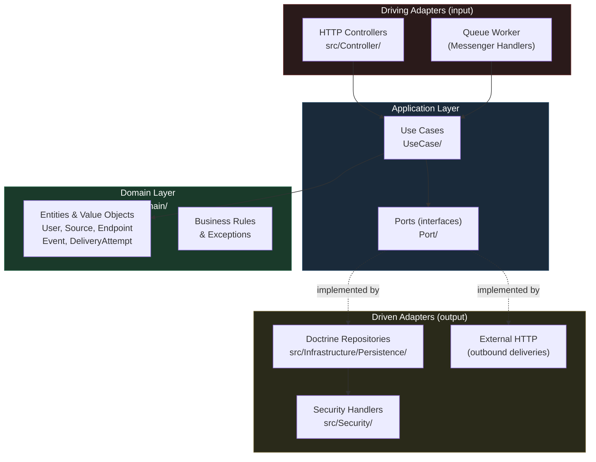

# WebhookApp

A fully Open Source **Webhook-as-a-Service (WaaS)** platform that receives webhooks from third-party services and fans them out to user-defined destination URLs with automatic retries and a delivery dashboard.

## Stack

| Layer | Technology |
|-------|-----------|
| Backend | PHP 8.4 / Symfony 7 |
| Frontend | React 18 + TypeScript + Vite |
| Database | PostgreSQL 17 |
| Queue | Symfony Messenger (Doctrine transport) |
| Deployment | Docker Compose (monolith) |

## Architecture

The backend follows **Hexagonal Architecture** (Ports & Adapters), keeping business logic completely isolated from the framework.



### Layer Rules

- **Domain** (`src/Domain/`) — pure PHP: entities, value objects, domain exceptions. Zero imports from `Symfony\` or `Doctrine\`.
- **Application** (`src/Application/`) — use cases that orchestrate domain objects through port interfaces.
- **Infrastructure** (`src/Infrastructure/`, `src/Controller/`, `src/Security/`) — Symfony/Doctrine adapters that implement the ports and expose HTTP endpoints.

### Webhook Delivery Flow

```
POST /in/{uuid}
    → persist Event
    → enqueue one Messenger message per active Endpoint
    → return 200 OK immediately

Worker:
    → POST raw body + headers to Endpoint URL
    → adds X-Webhook-Event-Id header
    → 5 attempts: immediate → 30s → 5m → 30m → 2h
    → recomputes events.status atomically (pending / delivered / failed)
```

## Development

### Start all services

```bash
docker compose up -d
```

### Backend (inside container or host)

```bash
php bin/console doctrine:migrations:diff      # generate migration from entity changes
php bin/console doctrine:migrations:migrate   # apply pending migrations
php bin/phpunit                               # run all tests
```

### Frontend

```bash
npm run build  # production build → public/
npm run watch  # Vite dev watch
```

## Data Model

| Table | Key columns |
|-------|-------------|
| `sources` | `inbound_uuid` (UUIDv7) |
| `events` | `source_id`, `status`, `received_at` |
| `endpoints` | `url`, `active` |
| `event_endpoint_deliveries` | unique `(event_id, endpoint_id)` |
| `delivery_attempts` | up to 5 per `(event_id, endpoint_id)` |
